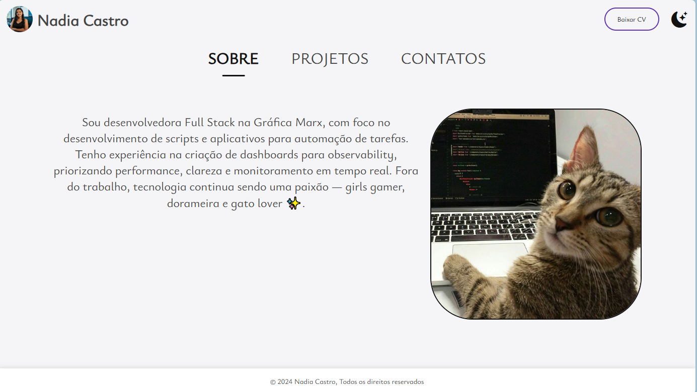
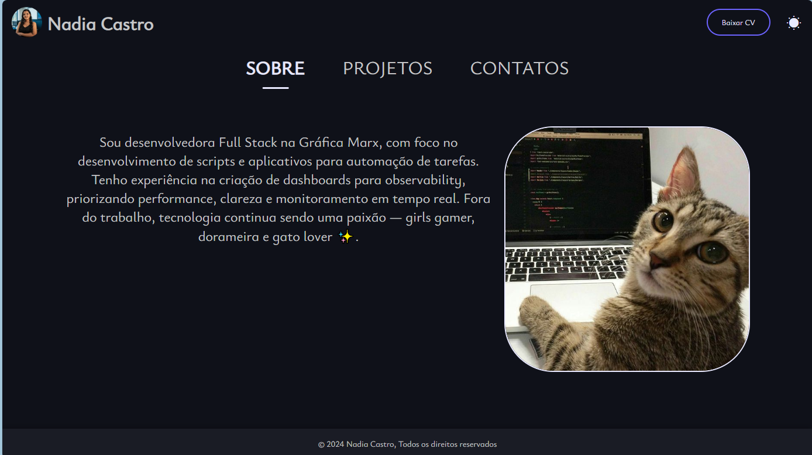

# Portfólio de Nadia Castro

[]([https://portfolio-nine-bay-30.vercel.app/])
[]([https://www.linkedin.com/in/nadia-naely/])
[]([https://github.com/nadiacastr0/portfolio])

---

Este é o meu portfólio pessoal, construído para apresentar meus projetos, habilidades e experiência como desenvolvedora Full Stack.


*Visualização do portfólio no tema claro.*

---


*Visualização do portfólio no tema escuro.*

---

## Tecnologias Utilizadas

* **Front-end:**
    * HTML
    * CSS
    * Biblioteca de UI: Bootstrap
* **Back-end:**
    * JavaScript
* **Outros:**
    * Git para controle de versão
    * Vercel para deploy

## Como Rodar Localmente
> **Se você quizer usar este projeto como exemplo**

1.  Clone este repositório:
    ```bash
    git clone https://github.com/nadiacastr0/portfolio
    ```
2.  Navegue até o diretório do projeto:
    ```bash
    cd portfolio
    ```
3.  Abra seu navegador em `http://127.0.0.1:5500/index.html` ou clique em Abrir com Live Server se tiver a extensão Live Server instalada no vs code.
